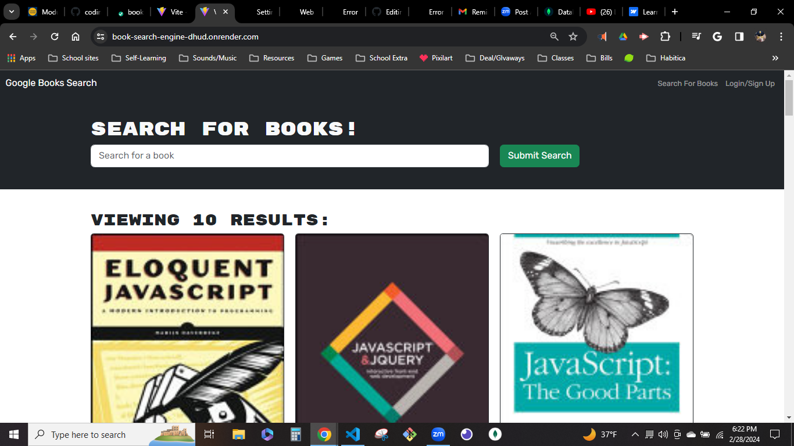
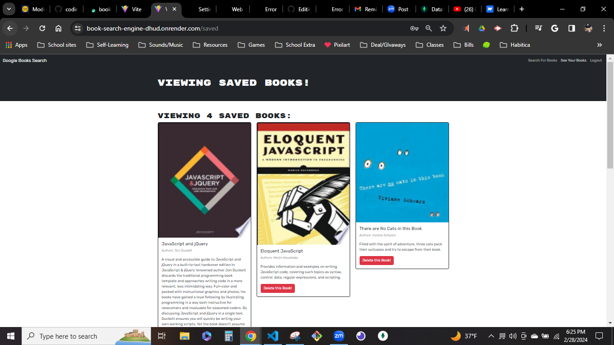

# book-search-engine-refactoring

## Description

This project is a challenge from UC Berkeley coding bootcamp and showcases my ability to refactor and understand different topics and technologies includeing RESTful APIs, GraphQL, Apollo Client/Server, and Jsonwebtoken.

This app allows users to search and save books to their account.

This project contains source code from https://github.com/coding-boot-camp/solid-broccoli repository, refactored to use GraphQl.

  ## Table of Contents 

  - [Description](#description)

  - [Table of Contents](#table-of-contents)

  - [Installlation](#installlation)

  - [Usage](#usage)

  - [License](#license)

  - [Contributing](#contributing)

  - [Tests](#tests)

  - [Questions](#questions) 

  ## Installation

  No installation required. View the site at [this link here.](https://book-search-engine-dhud.onrender.com/).

  ## Usage

  Use the search bar to find books. Sign up and login to an account using a username, email, and password. Once logged in books can be saved when searched and deleted from the 'See your books' tab.

  ## License

  N/A

  ## Contributing

  There are no guidelines or instructuions for contributing to this project.

  ## Tests

  N/A

  ## Questions

  - GitHub: [Kal-a11y](https://github.com/Kal-a11y/)